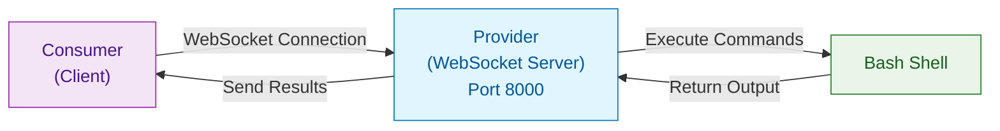
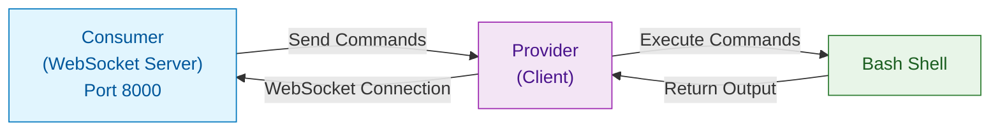
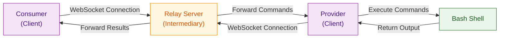
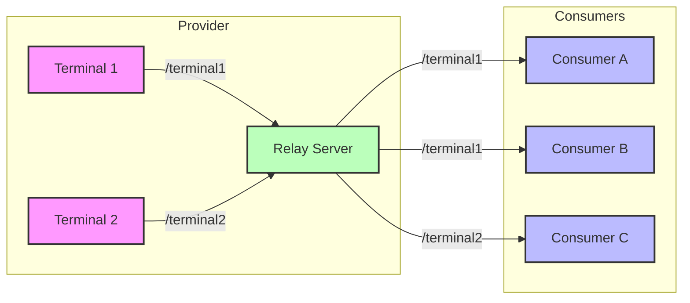

# WS-Terminal: Secure Remote Terminal Access via WebSockets

[](LICENSE)
[](https://developer.mozilla.org/en-US/docs/Web/API/WebSockets_API)
[]()

**WS-Terminal** is a cutting-edge solution for establishing secure remote terminal connections using WebSockets technology. It offers a superior alternative to traditional SSH by eliminating the need for inbound port forwarding, additional client-side software, and complex firewall configurations.

## Table of Contents

- [Overview](#overview)
- [Key Features](#key-features)
- [Connection Methods](#connection-methods)
- [Architecture](#architecture)
- [Requirements](#requirements)
- [Installation](#installation)
- [Usage](#usage)
  - [Method 1: Direct WebSocket Server](#method-1-direct-websocket-server)
  - [Method 2: Reverse Shell](#method-2-reverse-shell)
  - [Method 3: Relay Server Connection](#method-3-relay-server-connection)
- [Channel Support](#channel-support)
- [Security Considerations](#security-considerations)
- [Comparison with Alternatives](#comparison-with-alternatives)
- [Frequently Asked Questions (FAQs)](#frequently-asked-questions-faqs)
- [Contributing](#contributing)
- [License](#license)

## Overview

WS-Terminal revolutionizes remote terminal access by leveraging WebSocket technology to establish outbound connections, completely bypassing the need for inbound port forwarding or complex network configurations. This makes it ideal for environments with strict firewalls or NAT constraints.

## Key Features

- **No Inbound Ports Required**: Operates entirely through outbound connections
- **Firewall-Friendly**: Works in environments with strict security policies
- **Browser Compatibility**: Can be accessed directly from web browsers
- **Zero Client Installation**: No specialized software needed on the client side
- **Enhanced Security**: Reduced attack surface with no open inbound ports
- **Multiple Connection Methods**: Flexible deployment options for various scenarios
- **Multi-Channel Support**: Connect to multiple terminals via different channels

## Connection Methods

WS-Terminal supports three distinct connection methods:

1. **Direct WebSocket Server**: Provider hosts a WebSocket server, consumer connects as client
2. **Reverse Shell**: Consumer hosts a WebSocket server, provider connects as client
3. **Relay Server**: Both provider and consumer connect to an intermediary relay server

## Architecture

Key components in the WS-Terminal architecture:

- **Provider**: The machine where the terminal is running
- **Consumer**: The machine where the terminal is accessed
- **Relay Server (Optional)**: An intermediary server that forwards messages between provider and consumer

## Requirements

1. **websocat**: A WebSocket toolkit for the command line
   - Download the latest binary from [websocat GitHub releases](https://github.com/vi/websocat/releases)

2. **socat**: A multipurpose relay utility
   - Install via package manager: `apt install socat` (Debian/Ubuntu)
   - `brew install socat` (macOS)
   - `pacman -S socat` (Arch Linux)

3. **Relay server** (optional):
   - Use any WebSocket relay server, or
   - Self-host the recommended relay server: [ws-relay](https://github.com/uditrajput03/ws-relay)

**Reference**: [socat + websocat](https://github.com/vi/websocat/issues/108#issuecomment-800966664)

> **Security Note**: Always use trusted relay servers as they will have access to your terminal commands and output. Self-hosting is strongly recommended for sensitive environments.

## Installation

1. Clone this repository:
```bash
git clone https://github.com/uditrajput03/ws-terminal.git
cd ws-terminal
```

2. Download websocat (if not already installed):
```bash
# For Linux (64-bit)
curl -L https://github.com/vi/websocat/releases/download/v1.11.0/websocat_amd64-linux-static -o websocat
chmod +x websocat

# For macOS
curl -L https://github.com/vi/websocat/releases/download/v1.11.0/websocat.x86_64-apple-darwin20.4 -o websocat
chmod +x websocat
```

3. Install socat via your package manager if not already available.

## Usage

### Method 1: Direct WebSocket Server

The provider hosts a WebSocket server, and the consumer connects as a client.

**Provider side:** This creates a WebSocket server at port 8000 and execute every input as a bash shell command and return the output to the consumer.
```bash
./websocat -b ws-l\:0.0.0.0\:8000 exec:socat --exec-args - exec:"bash -li",pty,stderr,setsid,sigint,sane
```

**Consumer side:**
```bash
socat file:`tty`,raw,echo=0 exec:'./websocat --binary "wss://yourserverurl:8000/" "-"'
```


### Method 2: Reverse Shell

The consumer hosts a WebSocket server, and the provider connects as a client.

**Provider side:** This connects to the WebSocket and executes input as a bash shell command and returns the output to the socket.
```bash
./websocat -b ws://yourserverurl:8000 exec:socat --exec-args - exec:"bash -li",pty,stderr,setsid,sigint,sane
```

**Consumer side:** - This hosts a WebSocket server at port 8000 and waits for the provider to connect.
```bash
socat file:`tty`,raw,echo=0 exec:'./websocat --binary --exit-on-eof ws-l\:0.0.0.0\:8000 -'
```


### Method 3: Relay Server Connection

Both provider and consumer connect to an intermediary relay server.

**Provider side:**
```bash
./websocat -b wss://ws-relay-anlb.onrender.com/terminal1 exec:socat --exec-args - exec:"bash -li",pty,stderr,setsid,sigint,sane
```
**Consumer side:**
```bash
socat file:`tty`,raw,echo=0 exec:'./websocat --binary "wss://ws-relay-anlb.onrender.com/terminal1" "-"'
```
**Alternatively** You can send commands to the relay server using websocket client.


### Docker Usage

For containerized deployment of provider:

```bash
# Build image
docker build -t ws-terminal .

# Run with default relay
docker run -it ws-terminal

# Run with custom relay
docker run -it -e RELAY_URL="wss://your-relay.com/terminal1" ws-terminal

# At consumer side
socat file:`tty`,raw,echo=0 exec:'./websocat --binary "wss://your-relay.com/terminal1" "-"'
```

## Channel Support

If your relay server supports channels (like the recommended [ws-relay](https://github.com/uditrajput03/ws-relay)), you can establish multiple independent terminal sessions:



**Example usage:**
- Connect to `wss://ws-relay-anlb.onrender.com/terminal1` for the first terminal
- Connect to `wss://ws-relay-anlb.onrender.com/terminal2` for the second terminal

Any parameter can be used to create a channel for different terminals. Multiple consumers can connect to the same channel using the same URL, and all will see the same terminal output.


## Comparison with Alternatives


## Comparison with Alternatives

| Feature | WS-Terminal | SSH | Web-based Terminals | VNC |
|---------|------------|-----|---------------------|-----|
| Inbound Ports | No | Yes | Yes | Yes |
| Firewall Friendly | ✅ | ❌ | ⚠️ | ❌ |
| Authentication | Custom | Built-in | Custom | Password |
| Client Requirements | Minimal | SSH Client | Browser | VNC Client |
| Protocol | WebSocket | SSH | HTTP/WS | RFB |
| Encryption | TLS | SSH | TLS | Optional |
| Proxy Support | ✅ | ⚠️ | ✅ | ⚠️ |
| Browser Access | ✅ | ❌ | ✅ | ❌ |
| Performance | Medium | High | Medium | Low |
| Setup Complexity | Low | Medium | Medium | High |

## Security Considerations

- Always use WSS (WebSocket Secure) instead of WS for production environments
- Self-host relay servers for sensitive applications
- Apply proper authentication mechanisms for production deployments
- Regularly update dependencies to patch security vulnerabilities
- Limit the shell capabilities based on the use case to mitigate potential risks


## Frequently Asked Questions FAQs

### Is WS-Terminal secure?
Yes, when used with WSS (WebSocket Secure), all traffic is encrypted using TLS. However, like any terminal access tool, it should be secured with proper authentication mechanisms for production use.

### Does WS-Terminal work on Windows?
Yes, both websocat and socat have Windows versions, though they may require additional configuration. Windows Subsystem for Linux (WSL) offers the most straightforward setup.

### Can multiple users share the same terminal session?
Yes, multiple consumers can connect to the same channel on a relay server, creating a shared terminal experience similar to tools like tmate or tmux.

### How does latency compare to SSH?
WebSocket latency is comparable to SSH in most networks. The relay server method may introduce slight additional latency depending on server location.

### Can I integrate this with my web application?
Absolutely! The WebSocket-based approach makes it ideal for integration with web applications using libraries like xterm.js.

## Contributing

Contributions are welcome! Please feel free to submit a Pull Request.

## License

This project is licensed under the MIT License - see the LICENSE file for details.